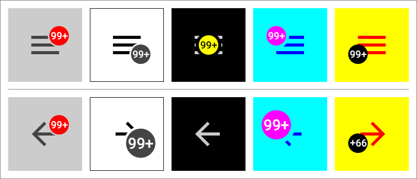
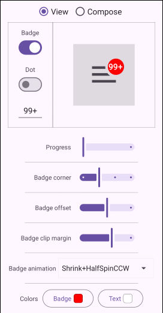

# Badged Drawer Arrows

An example of the androidx [`DrawerArrowDrawable`][DrawerArrowDrawable] class
extended to add a badge with various features.

<p align="center">

</p>

A Compose version is also included. It simply wraps the custom drawable in an
`IconButton`. I'd imagine there's already some other solution for Compose, but I
was curious and it was easy enough to put together.

The project has been set up as libraries and configured to be published, so you
can get compiled dependencies through the very handy service [JitPack][JitPack],
if the existing implementation happens to suit your needs.

## Contents

- [Added features](#added-features)
- [Usage](#usage)
  - [Views](#views)
    - [Using the support `ActionBar`](#using-the-support-actionbar)
    - [Using a `Toolbar` directly](#using-a-toolbar-directly)
  - [Compose](#compose)
    - [Quick and easy drawer setup](#quick-and-easy-drawer-setup)
    - [Manual drawer setup](#manual-drawer-setup)
- [Notes](#notes)

## Added features

`DrawerArrowDrawable` still works the same underneath, and all of its properties
and functions are still available as noted in its documentation.

This table briefly summarizes the new features added to
[`BadgedDrawerArrowDrawable`][BadgedDrawerArrowDrawable], and therefore also to
Compose's [`BadgedDrawerArrow`][BadgedDrawerArrow].

| Property              | Type              | Description                                 |
| --------------------- | ----------------- | ------------------------------------------- |
| `isBadgeEnabled`      | `Boolean`         | Whether a badge is drawn.                   |
| `badgeSize`           | `BadgeSize`       | Options for the badge's size.               |
| `badgeColor`          | `Int`/`Color`     | Color of the badge's background.            |
| `badgeCorner`         | `Corner`          | Which corner to center the badge on.        |
| `badgeOffset`         | `PointF`/`Offset` | For minor adjustments to badge placement.   |
| `badgeClipMargin`     | `Float`           | Margin clipped out of the base drawable.    |
| `badgeText`           | `String`          | (Optional) text to be drawn on the badge.   |
| `badgeTextColor`      | `Int`/`Color`     | Color of the badge's text, if any.          |
| `badgeTextOffset`     | `PointF`/`Offset` | For minor adjustments to text placement.    |
| `badgeAnimation`      | `Animation`       | (Optional) animation to apply to the badge. |
| `autoMirrorOnReverse` | `Boolean`         | Whether to mimic `ActionBarDrawerToggle`.   |

`ActionBarDrawerToggle` calls [`setVerticalMirror()`][setVerticalMirror] on its
`DrawerArrowDrawable` when its position value hits `0F` and `1F`, causing it to
rotate in the same direction when the drawer closes as when it opens. That's
what the `autoMirrorOnReverse` property does: tells the drawable to handle this
automatically without being attached to an `ActionBarDrawerToggle`.

## Usage

### Views

Like the base class, [`BadgedDrawerArrowDrawable`][BadgedDrawerArrowDrawable]
can be used on its own wherever you can stick a `Drawable`. You'll have to
handle animating the position value yourself, though, but other than that, it's
just a regular ol' drawable, really. The app in the `demo` module does it with a
`ValueAnimator`, so you can look there for an explicit demonstration.

There are a couple of slightly different ways to hook it up to
`ActionBarDrawerToggle`, and the following show the minimum requirements for
each, code-wise.

#### Using the support `ActionBar`

```kotlin
class ExampleActivity : AppCompatActivity() {

    private lateinit var toggle: ActionBarDrawerToggle

    override fun onCreate(savedInstanceState: Bundle?) {
        super.onCreate(savedInstanceState)

        val ui = ActivityExampleBinding.inflate(layoutInflater)
        setContentView(ui.root)

        supportActionBar?.setDisplayHomeAsUpEnabled(true)

        toggle = ActionBarDrawerToggle(
            this,
            ui.drawerLayout,
            R.string.opened,
            R.string.closed
        )
        toggle.drawerArrowDrawable =
            BadgedDrawerArrowDrawable(this).apply {
                isBadgeEnabled = true
                badgeText = "99+"
            }
        ui.drawerLayout.addDrawerListener(toggle)
    }

    override fun onOptionsItemSelected(item: MenuItem): Boolean {
        if (toggle.onOptionsItemSelected(item)) return true
        return super.onOptionsItemSelected(item)
    }

    override fun onPostResume() {
        super.onPostResume()
        toggle.syncState()
    }
}
```

That snippet assumes that your theme is supplying the `ActionBar`; i.e., it's
not a `NoActionBar` theme. If you're supplying your own `Toolbar` for the
`ActionBar`, then it's the same as above, just with a call to
`setSupportAction()` right after `setContentView()`.

If you're not using an `ActionBar` specifically, it can work with `Toolbar`
separately.

#### Using a `Toolbar` directly

```kotlin
class ExampleActivity : AppCompatActivity() {

    private lateinit var toggle: ActionBarDrawerToggle

    override fun onCreate(savedInstanceState: Bundle?) {
        super.onCreate(savedInstanceState)

        val ui = ActivityExampleBinding.inflate(layoutInflater)
        setContentView(ui.root)

        toggle = ActionBarDrawerToggle(
            this,
            ui.drawerLayout,
            ui.toolbar,
            R.string.opened,
            R.string.closed
        )
        toggle.drawerArrowDrawable =
            BadgedDrawerArrowDrawable(this).apply {
                isBadgeEnabled = true
                badgeText = "99+"
            }
        ui.drawerLayout.addDrawerListener(toggle)
    }

    override fun onPostResume() {
        super.onPostResume()
        toggle.syncState()
    }
}
```

### Compose

In many ways, [`BadgedDrawerArrow`][BadgedDrawerArrow] is easier to employ, and
like the `Drawable`, it can be used on its own, should you need it for something
other than a drawer. For example, if you just need a hamburger icon to sit there
and look pretty:

```kotlin
BadgedDrawerArrow(0F)
```

Or the arrow instead:

```kotlin
BadgedDrawerArrow(1F)
```

The bars' default color here is `LocalContentColor`, Compose's nifty mechanism
that helps to ensure an appropriate color to contrast with the background, so
you don't even have to worry about that for basic usage.

`BadgedDrawerArrow` also works well with Compose's animations, like
`animateFloatAsState()`, though it's obviously geared toward use with a drawer.
To that end, there's an overload that takes a `DrawerState`, sets
`autoMirrorOnReverse` to `true` by default, and automatically toggles the drawer
upon clicking, which makes for a quick and easy drawer setup.

#### Quick and easy drawer setup

```kotlin
@Preview(showBackground = true)
@OptIn(ExperimentalMaterial3Api::class)
@Composable
fun MinimalDrawerExample() {
    val drawerState = rememberDrawerState(DrawerValue.Closed)
    Column {
        TopAppBar(
            title = { Text("Example") },
            navigationIcon = { BadgedDrawerArrow(drawerState) }
        )
        ModalNavigationDrawer(
            drawerState = drawerState,
            drawerContent = {
                Box(
                    Modifier
                        .width(240.dp)
                        .fillMaxHeight()
                        .background(Color.Blue)
                )
            }
        ) {}
    }
}
```

This version doesn't offer an `onClick` parameter, however, so if you need to
perform additional work for clicks, you'll have to set up the toggle manually.

#### Manual drawer setup

```kotlin
@Preview(showBackground = true)
@OptIn(ExperimentalMaterial3Api::class)
@Composable
fun MinimalDrawerExample() {
    val scope = rememberCoroutineScope()
    val drawerState = rememberDrawerState(DrawerValue.Closed)
    Column {
        TopAppBar(
            title = { Text("Example") },
            navigationIcon = {
                BadgedDrawerArrow(progress = drawerState.progress()) {
                    scope.launch { drawerState.toggle() }
                }
            }
        )
        ModalNavigationDrawer(
            drawerState = drawerState,
            drawerContent = {
                Box(
                    Modifier
                        .width(240.dp)
                        .fillMaxHeight()
                        .background(Color.Blue)
                )
            }
        ) {}
    }
}
```

The `DrawerState.progress()` and `DrawerState.toggle()` extensions are public in
the Composables' file. The progress is calculated using a constant from the
Compose framework, `NavigationDrawerContainerWidth`, which of course is not
public, so a copy is included in that file too, just in case you need it for
your own figures.

## Notes

- **NB:** There appears to be a bug in Kotlin/Compose Compiler 2.0.20, as
  upgrading to that version seems to break `BadgedDrawerArrow` partially. It's
  still somehow updating correctly behind the scenes, but it looks like the
  hosting `View` isn't being invalidated correctly, 'cause manually invalidating
  it brings it up to date.

- Letters and numbers are not regular shapes, obviously, which makes it
  difficult to center them visually, especially in arbitrary combinations.
  Therefore, the current algorithm simply centers them according to their
  enclosing bounds, which is technically correct, but prone to certain strings
  looking very wrong. The `badgeTextOffset` property/parameter is available to
  fiddle with that placement, if needed.

- There are no code docs yet, unfortunately. They will be added eventually, but
  I'm sure you can figure things out in the meantime.

- The `demo` module contains a simple app that demonstrates pretty much all of
  the available features, in both frameworks.

<p align="center">

</p>

<br />

## License

MIT License

Copyright (c) 2024 Mike M.

Permission is hereby granted, free of charge, to any person obtaining a copy of
this software and associated documentation files (the "Software"), to deal in
the Software without restriction, including without limitation the rights to
use, copy, modify, merge, publish, distribute, sublicense, and/or sell copies of
the Software, and to permit persons to whom the Software is furnished to do so,
subject to the following conditions:

The above copyright notice and this permission notice shall be included in all
copies or substantial portions of the Software.

THE SOFTWARE IS PROVIDED "AS IS", WITHOUT WARRANTY OF ANY KIND, EXPRESS OR
IMPLIED, INCLUDING BUT NOT LIMITED TO THE WARRANTIES OF MERCHANTABILITY, FITNESS
FOR A PARTICULAR PURPOSE AND NONINFRINGEMENT. IN NO EVENT SHALL THE AUTHORS OR
COPYRIGHT HOLDERS BE LIABLE FOR ANY CLAIM, DAMAGES OR OTHER LIABILITY, WHETHER
IN AN ACTION OF CONTRACT, TORT OR OTHERWISE, ARISING FROM, OUT OF OR IN
CONNECTION WITH THE SOFTWARE OR THE USE OR OTHER DEALINGS IN THE SOFTWARE.


  [DrawerArrowDrawable]: https://developer.android.com/reference/kotlin/androidx/appcompat/graphics/drawable/DrawerArrowDrawable

  [JitPack]: https://jitpack.io/#gonodono/badged-drawer-arrows

  [BadgedDrawerArrowDrawable]: https://github.com/gonodono/badged-drawer-arrows/tree/main/view/src/main/kotlin/com/gonodono/bda/view/BadgedDrawerArrowDrawable.kt

  [BadgedDrawerArrow]: https://github.com/gonodono/badged-drawer-arrows/tree/main/compose/src/main/kotlin/com/gonodono/bda/compose/BadgedDrawerArrow.kt

  [setVerticalMirror]: https://developer.android.com/reference/kotlin/androidx/appcompat/graphics/drawable/DrawerArrowDrawable#setVerticalMirror(boolean)