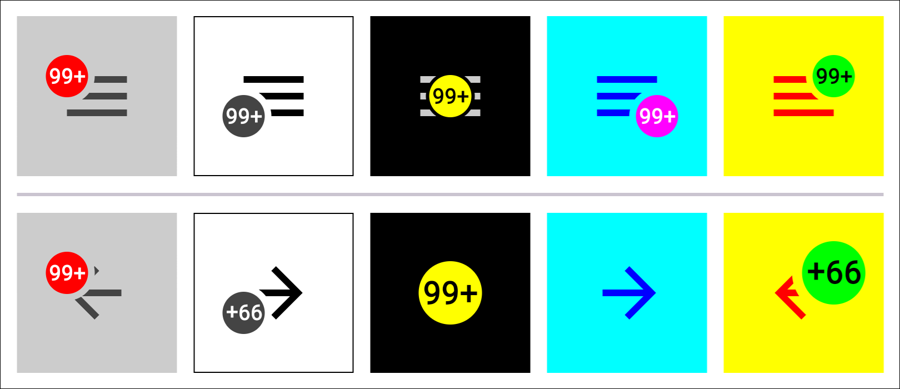

# Badged Drawer Arrows

An example of the androidx [`DrawerArrowDrawable`][DrawerArrowDrawable] class
extended to add a badge with various features.

<p align="center">

</p>

Multiple Compose versions are also included: base, `material`, and `material3`.
They simply wrap the drawable in some custom `Composable`s. I'd imagine there's
already some other solution for this framework, but I was curious and they were
easy enough to put together.

The project has been set up as libraries and configured to be published, so you
can get compiled dependencies through the very handy service [JitPack][JitPack],
if the existing implementation happens to suit your needs.

<br />

## Contents

- [Added features](#added-features)
- [Views](#views)
  - [Using the support `ActionBar`](#using-the-support-actionbar)
  - [Using a `Toolbar` directly](#using-a-toolbar-directly)
- [Compose](#compose)
  - [Automatic toggle setup](#automatic-toggle-setup)
  - [Manual toggle setup](#manual-toggle-setup)
  - [Manual drawer setup](#manual-drawer-setup)
- [Notes](#notes)

<br />

## Added features

`DrawerArrowDrawable` still works the same underneath, and all of its properties
and functions are still available as noted in its documentation.

This table briefly summarizes the new features added to
[`BadgedDrawerArrowDrawable`][drawable], and therefore to the Compose versions
as well.

| Property              | Type               | Description                                 |
|-----------------------|--------------------|---------------------------------------------|
| `isBadgeEnabled`      | `Boolean`          | Whether the badge is drawn.                 |
| `badgeSize`           | `BadgeSize`        | Options for the badge's size.               |
| `badgeColor`          | `Int`/`Color`      | Color of the badge's background.            |
| `badgeCorner`         | `Corner`           | Corner of hamburger to center the badge on. |
| `badgeOffset`         | `PointF`/`Offset`  | For minor adjustments to badge placement.   |
| `badgeClipMargin`     | `Float`            | Margin clipped out of the base drawable.    |
| `badgeText`           | `String`           | (Optional) text to be drawn on the badge.   |
| `badgeTextSize`       | `(Float) -> Float` | Allows adjustments to the default size.     |
| `badgeTextColor`      | `Int`/`Color`      | Color of the badge's text, if any.          |
| `badgeTextOffset`     | `PointF`/`Offset`  | For minor adjustments to text placement.    |
| `badgeMotion`         | `Motion`           | (Optional) animation to apply to the badge. |
| `autoMirrorOnReverse` | `Boolean`          | Whether to mimic `ActionBarDrawerToggle`.   |

`ActionBarDrawerToggle` calls [`setVerticalMirror(Boolean)`][setVerticalMirror]
on its `DrawerArrowDrawable` at positions `0F` and `1F` with alternating values,
causing it to rotate in the same direction when the drawer closes as when it
opens. That's what the `autoMirrorOnReverse` property does: tells the drawable
to handle this automatically without being attached to an
`ActionBarDrawerToggle`.

<br />

## Views

Like the base class, [`BadgedDrawerArrowDrawable`][drawable] can be used on its
own wherever you can stick a `Drawable`. You'd have to handle animating the
position value yourself, though, but other than that, it's just a regular ol'
drawable, really. The app in the `demo` module does it with a `ValueAnimator`,
but you could also hook it directly to a `DrawerLayout` using a simple
`DrawerListener`.

For standard usage, there are a couple of slightly different ways to hook it up
to `ActionBarDrawerToggle`, and the following snippets show the minimum
requirements for each, code-wise.

### Using the support `ActionBar`

<details>
    <summary><tt>ActionBarActivity</tt></summary>

```kotlin
class ActionBarActivity : AppCompatActivity() {

    private lateinit var toggle: ActionBarDrawerToggle

    override fun onCreate(savedInstanceState: Bundle?) {
        super.onCreate(savedInstanceState)

        val ui = ActivityActionBarBinding.inflate(layoutInflater)
        setContentView(ui.root)

        supportActionBar?.setDisplayHomeAsUpEnabled(true)

        toggle = ActionBarDrawerToggle(
            this,
            ui.drawerLayout,
            R.string.opened,
            R.string.closed
        )

        val context = supportActionBar?.themedContext ?: this
        toggle.drawerArrowDrawable =
            BadgedDrawerArrowDrawable(context).apply {
                isBadgeEnabled = true
                badgeText = "99+"
            }

        ui.drawerLayout.addDrawerListener(toggle)
    }

    override fun onPostResume() {
        super.onPostResume()
        toggle.syncState()
    }

    override fun onOptionsItemSelected(item: MenuItem): Boolean {
        if (toggle.onOptionsItemSelected(item)) return true
        return super.onOptionsItemSelected(item)
    }
}
```

</details>

That snippet assumes that your theme is supplying the `ActionBar`; i.e., it's
not a `NoActionBar` theme. If you're supplying your own `Toolbar` for the
`ActionBar`, then it's the same as above, just with a call to
`setSupportAction()` right after `setContentView()`.

If you're not using an `ActionBar` specifically, it can work with `Toolbar`
separately.

### Using a `Toolbar` directly

<details>
    <summary><tt>ToolbarActivity</tt></summary>

```kotlin
class ToolbarActivity : AppCompatActivity() {

    private lateinit var toggle: ActionBarDrawerToggle

    override fun onCreate(savedInstanceState: Bundle?) {
        super.onCreate(savedInstanceState)

        val ui = ActivityToolbarBinding.inflate(layoutInflater)
        setContentView(ui.root)

        toggle = ActionBarDrawerToggle(
            this,
            ui.drawerLayout,
            ui.toolbar,
            R.string.opened,
            R.string.closed
        )

        toggle.drawerArrowDrawable =
            BadgedDrawerArrowDrawable(ui.toolbar.context).apply {
                isBadgeEnabled = true
                badgeText = "99+"
            }

        ui.drawerLayout.addDrawerListener(toggle)
    }

    override fun onPostResume() {
        super.onPostResume()
        toggle.syncState()
    }
}
```

</details>

<br />

## Compose

There are three separate packages/modules for this framework, but all of the
basic functions are nearly identical, apart from the base's name, and several
package-specific values and defaults provided in `material` and `material3`.

- [`compose`][compose]

  This package contains the library's `BaseBadgedDrawerArrow` along with the
  various options' classes and values that are shared by all three modules here.
  Its default `barColor` is `Transparent`, and it has no minimum size, so be
  sure to specify a color, a width, and a height if using this one directly.

- [`material`][material]

  This one contains two functions:

  - The basic `BadgedDrawerArrow`, which is a simple wrapper around the
    `compose` module's `BaseBadgedDrawerArrow`, providing this package's
    `LocalContentColor`, `ripple()`, etc.

  - A `BadgedDrawerArrow` overload, which similarly wraps the base Composable,
    and which also utilizes a few helper classes and functions in order to
    integrate directly with this package's drawer components.

- [`material3`][material3]

  This module is essentially identical to `material` except for the relevant
  `import`s, and a very minor internal API difference or two. It has the
  corresponding `material3` versions of both functions as described above.

The basic functions' `progress` can be handled however you like: manually,
through an animation, etc. The overloads in `material` and `material3`, however,
will handle the progress automatically, if properly configured.

Each overload takes an instance of `DrawerToggle`, which exposes and manages a
`DrawerState` and its relative progress. These overloads also set
`autoMirrorOnReverse` to `true` by default, and automatically toggle the drawer
upon clicking, which makes for quick and easy drawer setups.

The following examples work with both `material` and `material3`.

### Automatic toggle setup

<details>
    <summary><tt>AutomaticToggleExample()</tt></summary>

```kotlin
private val DrawerWidth = 240.dp

@Preview(showBackground = true)
@Composable
fun AutomaticToggleExample() {
    val drawerToggle = rememberDrawerToggle(DrawerWidth)
    Column {
        BadgedDrawerArrow(drawerToggle)
        ModalNavigationDrawer(
            drawerState = drawerToggle.drawerState,
            drawerContent = {
                Box(
                    Modifier
                        .width(DrawerWidth)
                        .fillMaxHeight()
                        .background(Color.Blue)
                )
            }
        ) {}
    }
}
```

</details>

This version doesn't offer an `onClick` parameter, however, so if you need to
perform additional work for clicks, you'll have to set up the toggle manually.

### Manual toggle setup

<details>
    <summary><tt>ManualToggleExample()</tt></summary>

```kotlin
private val DrawerWidth = 240.dp

@Preview(showBackground = true)
@Composable
fun ManualToggleExample() {
    val drawerToggle = rememberDrawerToggle(DrawerWidth)
    Column {
        BadgedDrawerArrow(
            autoMirrorOnReverse = true,
            progress = drawerToggle.progress(),
            onClick = { drawerToggle.toggle(); /* Other things… */ }
        )
        ModalNavigationDrawer(
            drawerState = drawerToggle.drawerState,
            drawerContent = {
                Box(
                    Modifier
                        .width(DrawerWidth)
                        .fillMaxHeight()
                        .background(Color.Blue)
                )
            }
        ) {}
    }
}
```

</details>

If you wanna skip the `DrawerToggle` altogether, for whatever reason, it's only
a few more lines to provide all of the parts yourself.

### Manual drawer setup

<details>
    <summary><tt>ManualDrawerExample()</tt></summary>

```kotlin
private val DrawerWidth = 240.dp

@Preview(showBackground = true)
@Composable
fun ManualDrawerExample() {
    val scope = rememberCoroutineScope()
    val drawerState = rememberDrawerState(DrawerValue.Closed)
    Column {
        BadgedDrawerArrow(
            autoMirrorOnReverse = true,
            progress = drawerState.progress(DrawerWidth),
            onClick = { scope.launch { drawerState.toggle() } }
        )
        ModalNavigationDrawer(
            drawerState = drawerState,
            drawerContent = {
                Box(
                    Modifier
                        .width(DrawerWidth)
                        .fillMaxHeight()
                        .background(Color.Blue)
                )
            }
        ) {}
    }
}
```

</details>

The `DrawerState.progress()` and `DrawerState.toggle()` extensions are
available in both `material` and `material3`.

<br />

## Notes

- Currently, the main caveat is that there are basically no restrictions or
  checks or coercions on input. For example, the badge is designed to show
  numbers of length 1..3 relatively comfortably, but it does not prevent you
  from entering values outside of that range, and neither does it do anything to
  correct an out-of-bounds value before application. Checks may be added in the
  future, but for now, it's up to the user to ensure workable input for the
  desired results.

- The text layout is geared toward number glyphs. That is, the default text
  sizes were calculated to work well with any number of length 1..3, but a
  string of "MMM", for example, would end up being wider than the badge. If
  needed, the `badgeTextSize` property and parameter are
  `(default: Float) -> Float` functions to allow adjustments.

- Letters and numbers are not regular shapes, obviously, which makes it
  difficult to center them visually, especially in arbitrary combinations.
  Therefore, the current algorithm simply centers them according to their
  enclosing bounds, which is technically correct, but prone to causing some
  strings to look very wrong. The `badgeTextOffset` property/parameter is
  available to fiddle with the text placement, if needed.

- The default values for the hamburger-arrow dimensions – e.g., `barThickness`,
  `arrowHeadLength`, etc. – come from styles in appcompat themes, and they're
  all pretty consistent across configurations, except for `barLength` and
  `gapBetweenBars`, which differ as follows:

  | Attribute        | values | values-hdpi |
  |------------------|-------:|------------:|
  | `barLength`      | `18dp` |   `18.66dp` |
  | `gapBetweenBars` |  `3dp` |    `3.33dp` |

  I have no idea why those are the only ones that change, nor why it's only by a
  handful of pixels at most, but I decided to ignore this, and the defaults in
  both frameworks are always the integer `values`, regardless of the current
  configuration.

- For now, this project is considered to be examples more than a proper library.
  Consequently, there are several lint warnings across the project about unused
  elements, some things that should be hidden might be visible, and things may
  break without prior warning or deprecation.

- The `demo` module contains a simple app that demonstrates most of the
  available features, in both frameworks.

<p align="center">

</p>

<br />

## License

MIT License

Copyright (c) 2025 Mike M.

Permission is hereby granted, free of charge, to any person obtaining a copy of
this software and associated documentation files (the "Software"), to deal in
the Software without restriction, including without limitation the rights to
use, copy, modify, merge, publish, distribute, sublicense, and/or sell copies of
the Software, and to permit persons to whom the Software is furnished to do so,
subject to the following conditions:

The above copyright notice and this permission notice shall be included in all
copies or substantial portions of the Software.

THE SOFTWARE IS PROVIDED "AS IS", WITHOUT WARRANTY OF ANY KIND, EXPRESS OR
IMPLIED, INCLUDING BUT NOT LIMITED TO THE WARRANTIES OF MERCHANTABILITY, FITNESS
FOR A PARTICULAR PURPOSE AND NONINFRINGEMENT. IN NO EVENT SHALL THE AUTHORS OR
COPYRIGHT HOLDERS BE LIABLE FOR ANY CLAIM, DAMAGES OR OTHER LIABILITY, WHETHER
IN AN ACTION OF CONTRACT, TORT OR OTHERWISE, ARISING FROM, OUT OF OR IN
CONNECTION WITH THE SOFTWARE OR THE USE OR OTHER DEALINGS IN THE SOFTWARE.


  [DrawerArrowDrawable]: https://developer.android.com/reference/kotlin/androidx/appcompat/graphics/drawable/DrawerArrowDrawable

  [JitPack]: https://jitpack.io/#gonodono/badged-drawer-arrows

  [drawable]: view/src/main/kotlin/com/gonodono/bda/view/BadgedDrawerArrowDrawable.kt

  [compose]: compose/src/main/kotlin/com/gonodono/bda/compose/BaseBadgedDrawerArrow.kt

  [material]: material/src/main/kotlin/com/gonodono/bda/material/BadgedDrawerArrow.kt

  [material3]: material3/src/main/kotlin/com/gonodono/bda/material3/BadgedDrawerArrow.kt

  [setVerticalMirror]: https://developer.android.com/reference/kotlin/androidx/appcompat/graphics/drawable/DrawerArrowDrawable#setVerticalMirror(boolean)